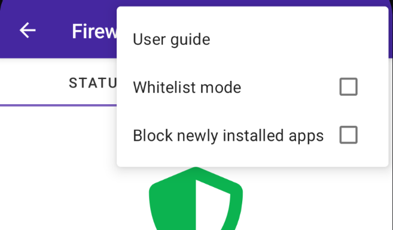
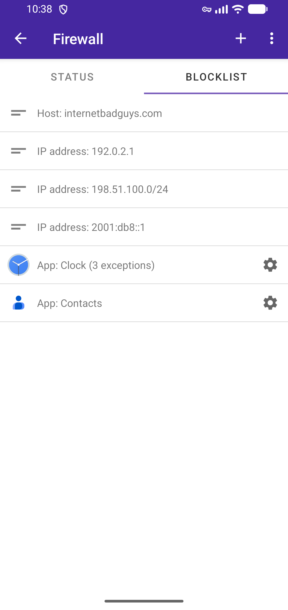
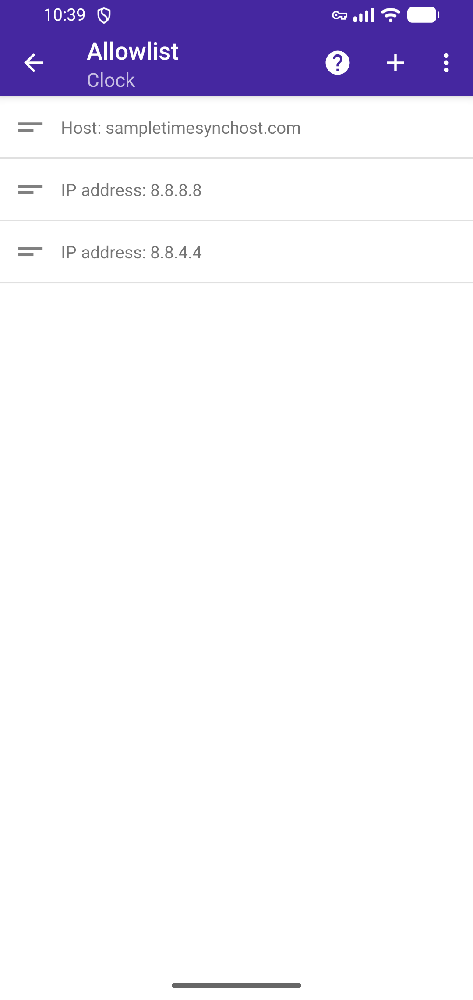
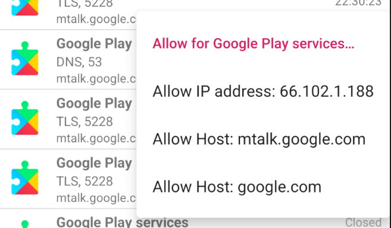
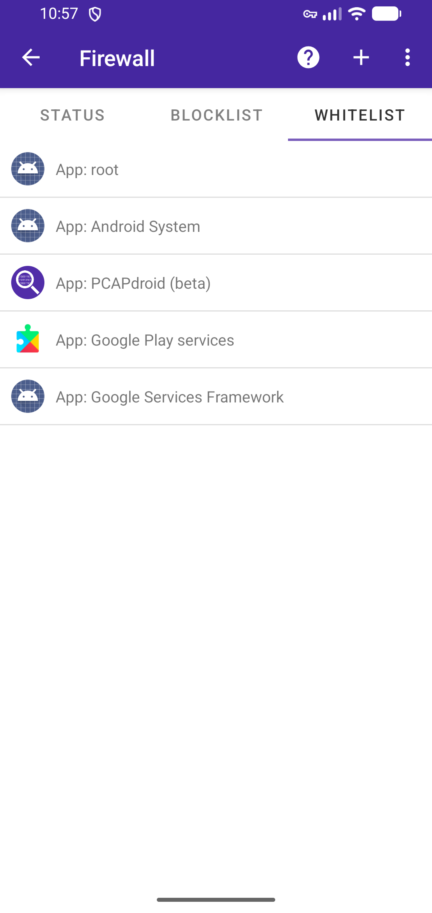

PCAPdroid provides some paid features which extend the functionalities of the app. If you installed the app from [Google Play](https://play.google.com/store/apps/details?id=com.emanuelef.remote_capture), you can buy them from the "Paid Features" entry in the left drawer. Purchases from the Google Play store are bound to your Google Play account, so you can buy them once and access them on all your devices.

If you install beta builds of PCAPdroid from the [beta repository](https://pcapdroid.org/fdroid/repo), you can access paid features in the beta build as long as you have the official app installed (you can install both the official release and the beta builds alongside) and you have purchased them in the official app.

If you installed the app from F-Droid or from the Github releases, it is still possible to access the paid features but it requires some extra steps. In order to access the paid features on **non-Google-Play** builds of the app, you will need to get an *unlock token*, which you can then use to generate a license code for your device. Here are the steps you need to follow. It's recommendend to watch this [video tutorial](https://youtu.be/b108fy2z_X4).

1\. Purchase an *unlock token* from [the Google Play app](https://play.google.com/store/apps/details?id=com.emanuelef.remote_capture) (available since PCAPdroid v1.5.5). Be sure to note down this token, as you will need it to generate new licenses. The unlock token is not bound to the device, so you can purchase it from a friend phone
 

2\. Install PCAPdroid from [F-Droid](https://f-droid.org/packages/com.emanuelef.remote_capture) or from the [Github releases](https://github.com/emanuele-f/PCAPdroid/releases) on your device (you will need to uninstall the Google Play app from previous step if you operate on the same device) and retrieve its *installation ID* (or *system ID*). You can find it in the "About" page in the left drawer
 

3\. Generate a license code for your build on [pcapdroid.org/getlicense](https://pcapdroid.org/getlicense), by providing the unlock token and the installation ID

4\. Paste your license code in the About page of PCAPdroid, below your installation ID
 

Congratulations, you can now access the paid features of PCAPdroid! Please note that the installation ID will change as a result of the following events:

- Uninstall and reinstall the app
- Factory reset
- Reinstall the system rom

If your installation ID changes, you will need to generate a new license code for your device. With a single unlock token you can generate up to 3 license codes to use on your devices.

## 5.1 Firewall

**NOTE**: the firewall feature is not available with the [root capture](advanced_features#44-root-capture)

The firewall feature complements traffic visibility provided by PCAPdroid with the ability to block connections. This combination becomes a powerful tool to increase your privacy.

Most apps implement some sort of analytics and periodically phone home, possibly sending out sensitive data. When monitoring traffic with PCAPdroid, you may have noticed that even some system apps like the camera or the photo gallery make connections to the Internet, which is at least unexpected. As most of the traffic is encrypted, it's not easy to determine what kind of information is sent to the remote server and if that connection is actually required to implement the app functionalities or it's only used to send out analytics.

PCAPdroid allows you to define your own set of rules to block Internet access to specific apps, domains or IP addresses. This gives you the flexibility to choose what to block, being it a whole app, if you determine that such app should not require Internet access, or specific domains, if the app needs Internet access to work correctly but you still want to block specific domains which you suspect may affect your privacy.

To create a block rule, long tap a connection in the Connections tab and choose to block the app, the IP address or the host. Blocking a second-level domain like `example.org` will cause all of its subdomains to be blocked (e.g. `some.example.org` and `img.example.org`). This only applies to second-level domains, so blocking `another.example.org` will *not* block `yet.another.example.org`.

The block rule will be applied both to the active connections and to the new connections. A *ban* sign helps you identify blocked connections. You can easily review all the blocked connections by tapping the filter icon in the action bar and applying a *Firewall Blocked* filter. You can unblock a connection by long pressing it and choosing *unblock* from the context menu. When unblocking an app, you can decide to unblock it permanently, by removing it from the blocklist, or give it a grace period and reblock it automatically after some hours. You can also review and delete the blocking rules from the blocklist tab as explained below.

Blocked apps can be visually identified in the *Apps* view via their *ban* sign.

When blocking an app, keep in mind the following:

- The app will still be able to perform name resolution (DNS). In Android, the `netd` daemon performs name resolution on behalf of the apps, so it's not possible to determine which app made the DNS query
- The app may still communicate with Google services via IPC, e.g. receive push notifications and show ads
- The app may show locally cached content (e.g. a cached web page)
- The app may still request downloads via the [Download Manager](https://developer.android.com/reference/android/app/DownloadManager)

### Status and Blocklist

From the left drawer, you can access the firewall settings and status.

In the status tab, you can see some statistics about the firewall, like the number of blocked connections and the time of the last block. Tap on the "Connections blocked" card to show the list of blocked connections.

Via the on/off toggle in the action bar, you can enable/disable the firewall at runtime. From the action bar menu, you can also enable the ability to *block newly installed apps*. This will automatically add new apps to the blocklist and block their traffic as soon as they are installed. The *whitelist* mode can be toggled from here as well and it's explained below.

In the blocklist tab, you can see the list of the blocking rules that you have defined. You can long press rules to select and delete them. You can also export the rules to a file to back them up or share them with other people, who can add them to their existing rules. By clicking the "+" button, you can add new rules directly from here.

### App isolation

When installing untrusted apps, it's useful to block all the app traffic and only allow some specific hosts. In some other cases, e.g. for privacy reasons, you may want to only enable a minimal set of hosts to make the app work, while keeping the rest of analytics blocked. To do this, tap on an app entry in the *Blocklist* to access its *Allowlist*.

Here you can configure the set of IP addresses or domains that the app is allowed to contact. You can also allow a host directly from the connections menu, by long pressing the connection and selecting "Allow for *app*..." and then what to allow.

### Whitelist mode

When the whitelist mode is enabled, all the device traffic is blocked by default, unless manually whitelisted. In essence, this is a "block all" mode, the opposite of the "allow all" mode that the firewall enables by default.

This mode is suitable, for example, when you want to heavily save network data, e.g. during roaming, by only allowing specific apps to access the Internet, or you want strict control on your device traffic. This mode may also block important system services, e.g. update checks or instant messaging, so it must be used with care. After enabling it, be sure to check the blocked connections and monitor the device operations to be sure that nothing important breaks.

The *whitelist* tab allows you to review and configure the allowed apps.

Some apps like the Google Play services are allowed by default here since they are needed for some essential Android services to work correctly. The *root* app, in particular, includes many privileged system services that should not be blocked.

In the whitelist mode, you can still configure block rules in the *blocklist* tab; block rules have precedence over the whitelist rules, so for example if an app is both in the *blocklist* and in the *whitelist*, it will be blocked. If you configure an allowed host in the *allowlist* of an app, it will be allowed like in the standard firewall mode, giving you max flexibility.

## 5.2 Malware Detection

**DISCLAIMER**: *the malware detection feature of PCAPdroid is not a comprehensive solution for the security of your device. The author provides no guarantee on the malware detection capabilities or on the accuracy of PCAPdroid and he can not be held liable for any direct or indirect damage caused by its use.*

The malware detection feature enables PCAPdroid to detect malicious hosts by the means of third-party blacklists. The detection is only active when the capture is running. Since version 1.4.5, when running in the default VPN mode, PCAPdroid will also **block** all the traffic directed to and coming from the malicious hosts. Blocking *does not occur* when running in [root mode](advanced_features#44-root-capture).

Today our devices are exposed to a variety of threats: phishing, online scams, ransomware and spyware to name a few. When it comes to security, precautions are never enough and no solution will fit all the needs. The malware detection feature of PCAPdroid can help detecting malicious connections as they happen, bringing the possible threat to the user attention, as well as preventing damage by blocking the communication. Here are some contexts where it finds applicability:

- The user browsers a known malicious website (e.g. phishing, scam)
- The user installs a malicious app or addon (e.g. spyware) which connects to a malicious domain/IP
- The device is exploited and a malware is installed (e.g. spyware, ransonware or C&C), which connects to a malicious domain/IP

Whenever PCAPdroid detects a malicious connection, it reports the event to the user via a notification.

You can manually test the detection by visiting the legit website [www.internetbadguys.com](http://www.internetbadguys.com). The notification reports the app which made the connection and the IP address or domain which triggered the detection. By clicking on the notification, it is possible to get the list of all the malicious connections made by the app.

The "malicious" connection filter can be applied at any time from the "Edit Filter" dialog. The malicious connections data is lost once the capture is stopped. When a connection is blocked, a "ban" sign is shown next to the malicious indicator.

In this case, PCAPdroid has blocked the communication with the malicious website.

PCAPdroid provides an overview on the status of the malware detection, which is available in the "Malware Detection" entry in the left drawer. The Status tab shows the current status of the malware detection.

A green checkmark indicates that no malicious connections have been detected during the capture. It is replaced by a red danger sign if malware traffic is detected.
The cards below the mark provide some indicators for the malware detection:

- The "Updated blacklists" reports the number of successfully updated blacklists over the total blacklists number. PCAPdroid updates the blacklists once a day to ensure that it can catch the newest threats. If some download fails, a manual update can be triggered from the "Blacklists" tab.
- The "Last update" reports the last time the blacklists were updated.
- The "IP" and "Domain" rules indicates the total number of unique rules that PCAPdroid is using to perfom the malware detection.

The "Blacklists" tab shows the status of each individual blacklist in use.

The blacklists used by PCAPdroid contain a list of domains and IP addresses with a bad reputation. This includes scanners, brute-forcers and known sources of malware. The blacklists normally contain some static rules, which are based on the past infections data, and some dynamic rules, which are generated automatically, usually via honeypots.

Each blacklist entry specifies the number of unique rules in use. Duplicate rules are only counted once so some blacklists may show 0 rules if they are already part of another blacklist. The "Last update" field shows the last time a given blacklist was updated. By clicking on the blacklist title, it is possible to open the blacklist to manually review the rules it contains. By clicking on the refresh icon in the action bar it is possible to manually trigger a blacklists update.

Finally the "Whitelist" tab show the rules which are part of the whitelist. If the malware detection gets triggered by a false positive, you can long press a malicious connection and whitelist the genuine IP, domain or even the app.

## 5.3 Pcapng Format

Pcapng is an extensible file format for packet captures, an alternative to the traditional pcap format. In the context of PCAPdroid, Pcapng comes in handy because of the following reasons:

- best storage for the [PCAPdroid extensions](advanced_features#45-pcapdroid-extensions): the extensions are stored as standard Pcapng extension blocks, instead of relying on "hacks" to store them in a fake Ethernet trailer. This also reduces the capture size
- easy sharing of decrypted captures: when using the [TLS decryption](tls_decryption), PCAPdroid embeds the TLS master secrets directly into the Pcapng file, without the need to use a separate SSLKEYLOG file. This means, the keys always stay together with the related traffic, and you can just open the Pcapng file in Wireshark to get the decrypted traffic without any additional setup

After purchasing the feature, you can enable it from the PCAPdroid preferences.

